<p align="center">
  
</p>

# 🛍️ JetShop – Modern E-Commerce Android App (Jetpack Compose)

Welcome to **JetShop**, a powerful and cleanly architected e-commerce Android application built using the latest **Jetpack Compose** and **Kotlin** tools. Whether you're a developer looking to learn or a business aiming to scale, JetShop delivers speed, elegance, and functionality.

---
## ✅ App Features Overview

| Section                  | Feature Description                                                | Status                |
|--------------------------|--------------------------------------------------------------------|-----------------------|
| 🔐 **Authentication**    | Onboarding Screens                                                 | ✅ Completed           |
|                          | Login / Register                                                  | ✅ Completed           |
|                          | Forgot Password                                                   | ✅ Completed           |
|                          | Verify OTP                                                        | ✅ Completed           |
|                          | Reset Password                                                    | ✅ Completed           |
| 🏠 **Home & Browsing**    | Home Page with Auto Slider                                        | ✅ Completed           |
|                          | Category List                                                     | ✅ Completed           |
|                          | Product List                                                      | ✅ Completed           |
|                          | Split Category & Brandwise Products                               | ✅ Completed           |
|                          | Product Detail View                                               | ✅ Completed           |
|                          | Write & View Reviews                                              | ✅ Completed           |
|                          | Search Products                                                   | ✅ Completed           |
|                          | Subscribe to Prime Membership                                     | ✅ Completed           |
| ❤️ **Wishlist & Cart**    | Wishlist with Swipe to Add/Remove                                 | ✅ Completed           |
|                          | Add/Remove Items to/from Cart                                     | ✅ Completed           |
|                          | Cart Screen with Quantity Update and Item Removal                 | ✅ Completed           |
| 💳 **Checkout & Payment** | Checkout Screen                                                   | ✅ Completed           |
|                          | Place Order Screen                                                | ✅ Completed           |
|                          | Razorpay Integration for Online Payment                           | ✅ Completed           |
|                          | COD (Cash on Delivery) Support                                    | ✅ Completed           |
|                          | Payment with Prime Subscription Plan                              | ✅ Completed           |
|                          | Order Success Screen                                              | ✅ Completed           |
| 🔍 **Core Screens**       | Search Screen                                                     | ✅ Completed           |
|                          | User Order History                                                | ✅ Completed           |
|                          | Notifications History                                             | ✅ Completed           |
|                          | Blogs Screen (with Details)                                       | ✅ Completed           |
|                          | Address Management (Add / Update / Delete)                        | ✅ Completed           |
|                          | Coupon Code Screen                                                | ✅ Completed           |
|                          | Help & Support Screen                                             | ✅ Completed           |
|                          | About App Screen                                                  | ✅ Completed           |
| ⚙️ **Settings**            | Notification On/Off                                               | ✅ Completed           |
|                          | Clear Cache                                                       | ✅ Completed           |
|                          | App Theme                                                         | ⚠️ *Under Development* |
|                          | Privacy Policy                                                    | ✅ Completed           |
|                          | Terms & Conditions                                                | ✅ Completed           |
| 🤝 **Refer & Earn**       | Share referral code with inbuilt contact list                     | ✅ Completed           |
|                          | Referral History                                                  | ✅ Completed           |
|                          | Wallet History                                                    | ✅ Completed           |

---
## 📹 App Walkthrough (Video)

Curious how the app works? Watch the full demo video on YouTube:

[](https://www.youtube.com/watch?v=rgYn_bv07ys)

---
## 📲 App Screens
| Screenshot | Screenshot | Screenshot |
|------------|------------|------------|
| 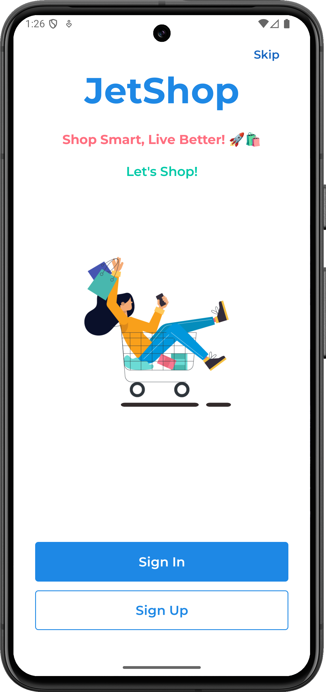 | 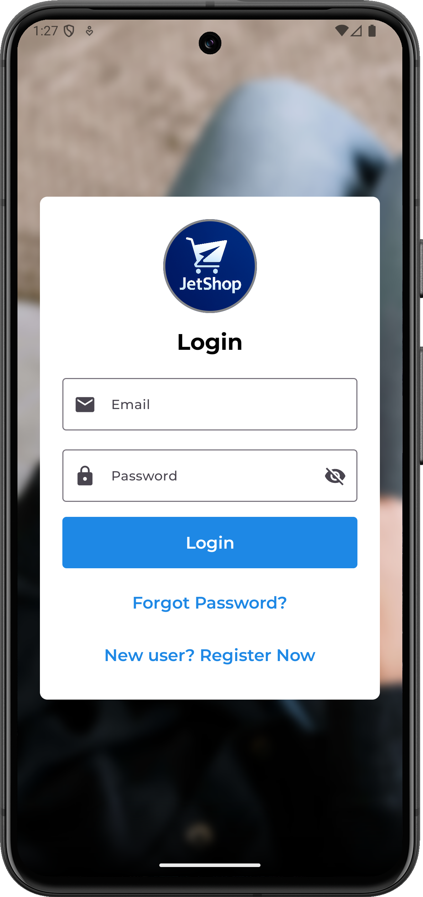 | 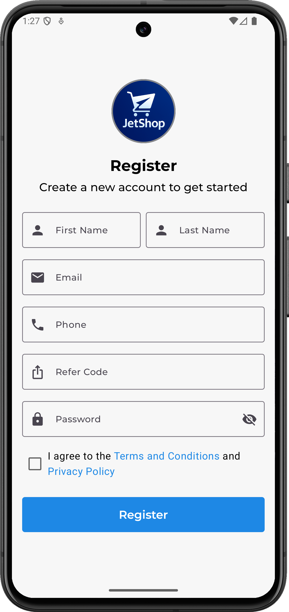 |
|  | 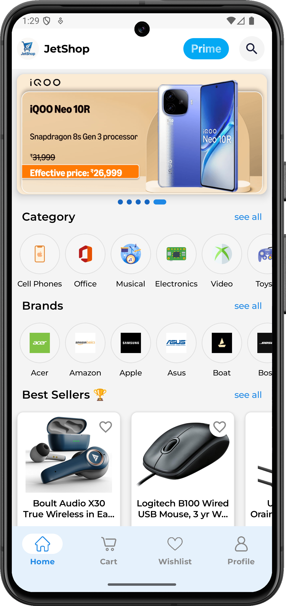 | 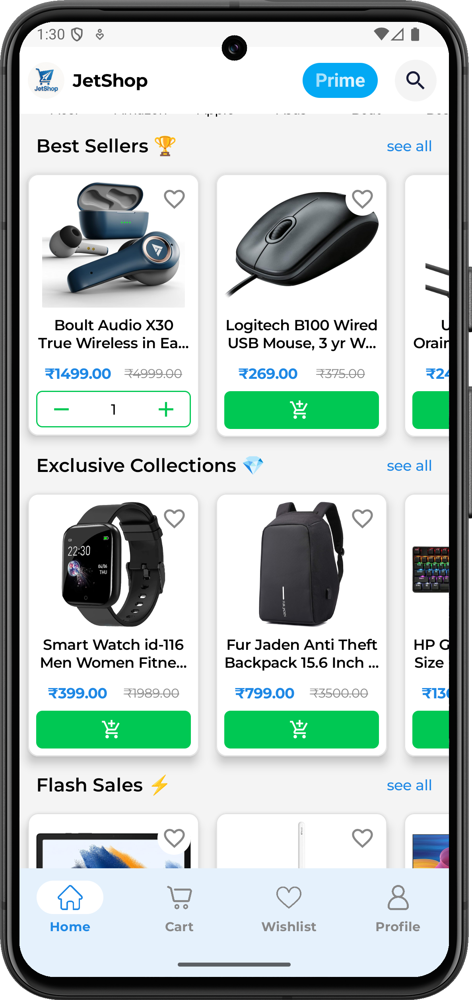 |
| 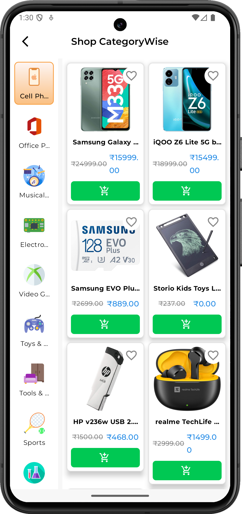 | 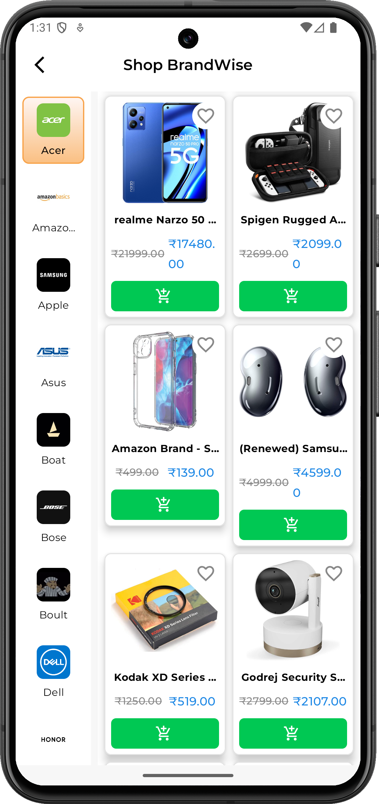 | 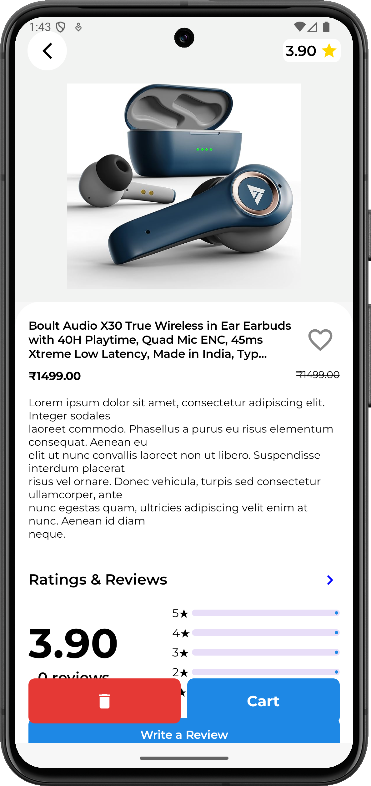 |
| 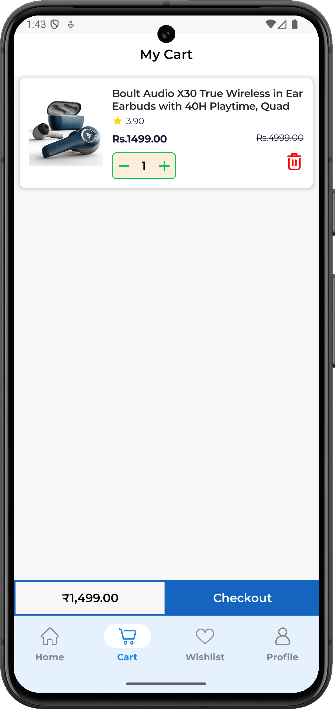 | 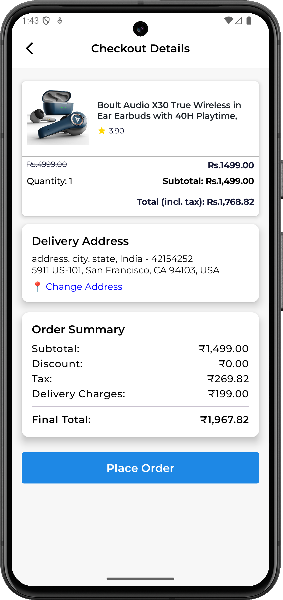 | 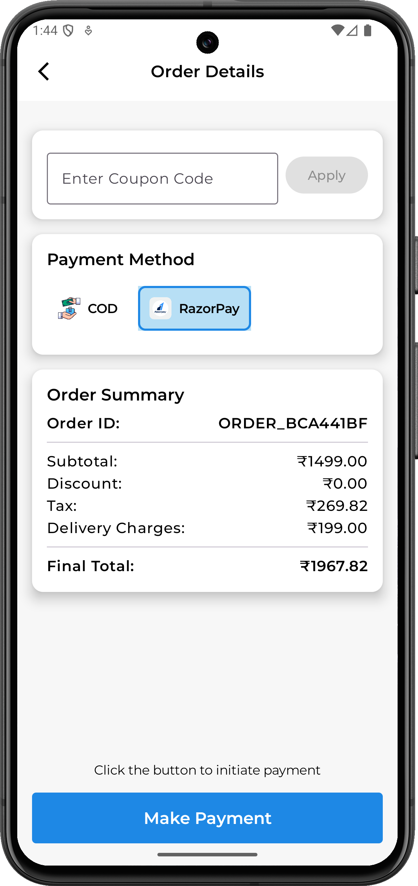 |
| 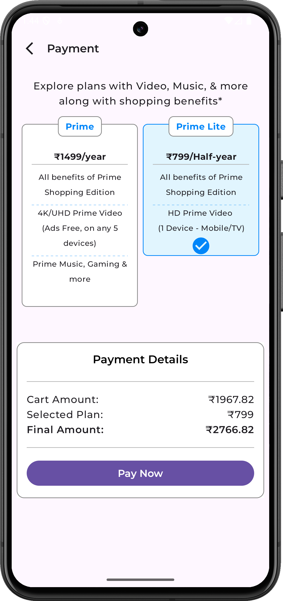 | 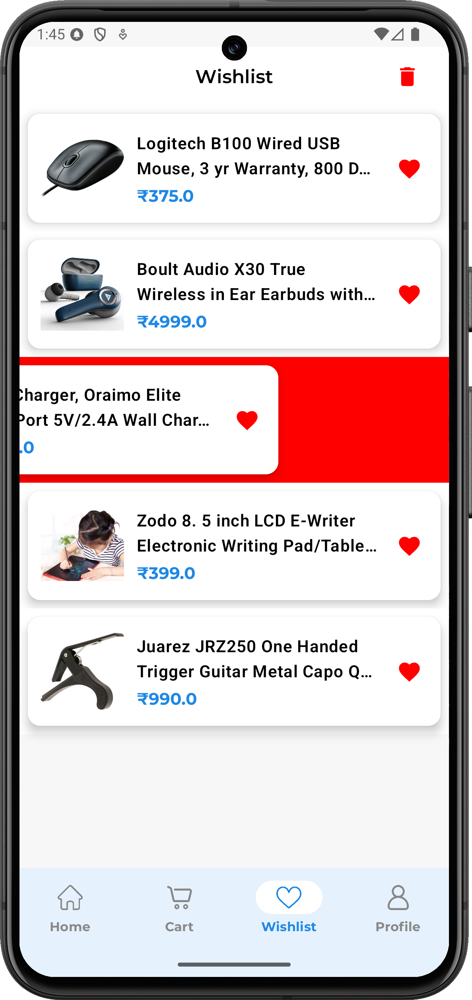 | 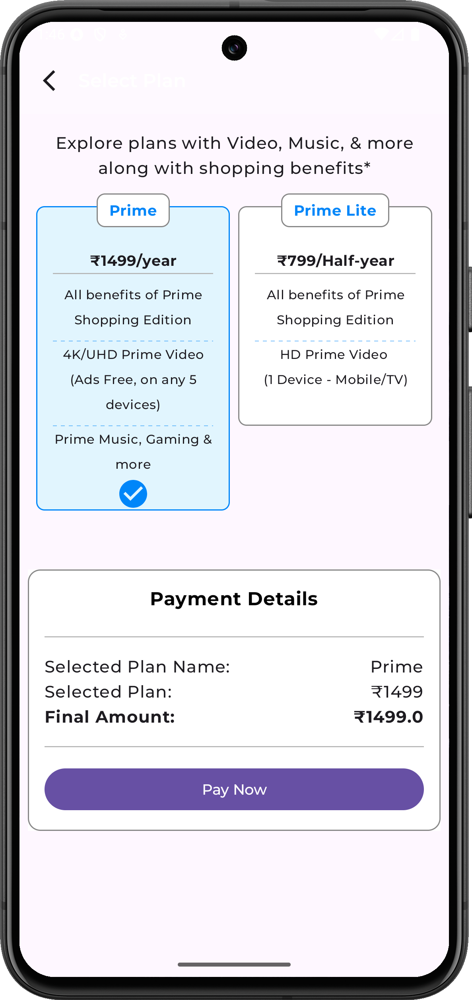 |
| 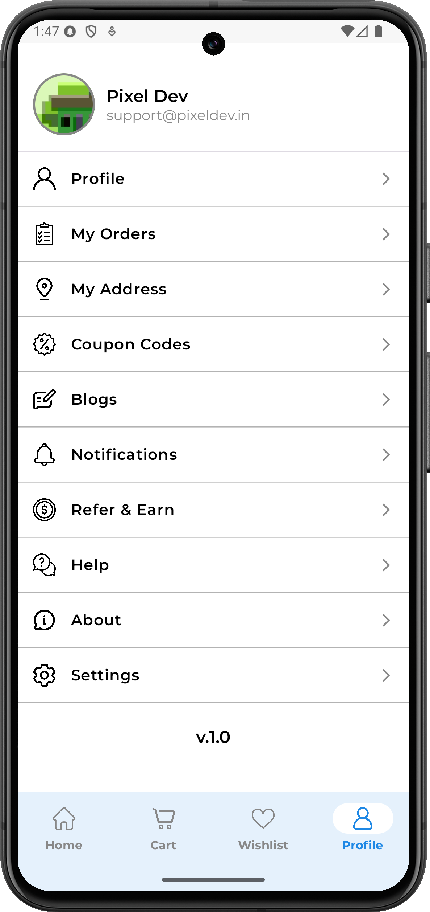 | 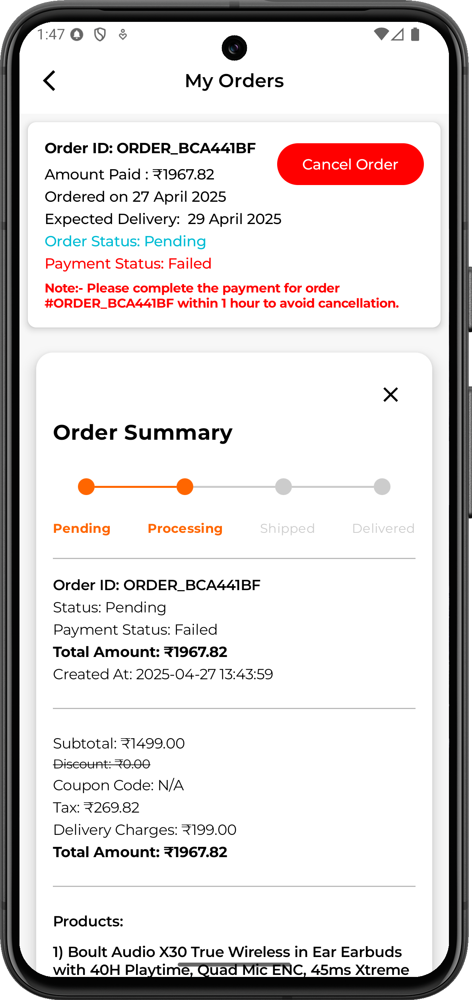 | 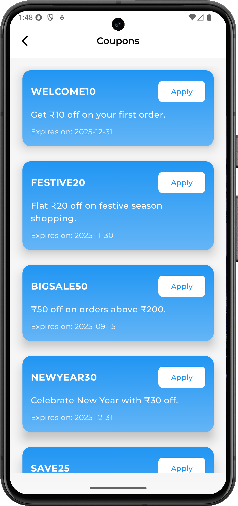 |
| 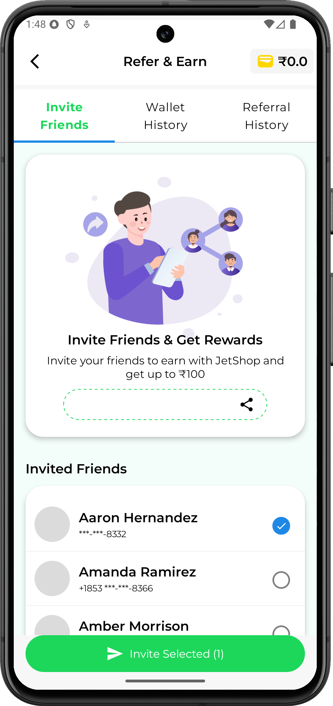 | | |

## 🔗 Deep Link Integration

### Supported Deep Links:

#### 📩 Referral Code
> Opens the Register screen with prefilled referral code.
```bash
adb shell am start -a android.intent.action.VIEW \
-d "https://pixeldev.in/referinvite/JetShopx-1234" \
com.compose.jetshop
```

#### 🛍️ Product Page
> Opens the specific product detail page using product code.
```bash
adb shell am start -a android.intent.action.VIEW \
-d "https://pixeldev.in/product/PROD301" \
com.compose.jetshop
```

---
## 🛠 Tech Stack & Libraries

JetShop is built with modern Android tech and best practices:

| 💼 Tech / Library       | ✅ Used For                           |
|------------------------|----------------------------------------|
| 🧱 Jetpack Compose      | UI Toolkit                            |
| 🧠 MVVM Architecture    | App Structure                         |
| 💉 Hilt                 | Dependency Injection                  |
| 🔄 Kotlin Flow          | Reactive Data Handling                |
| 🗄 Room Database        | Local Database                        |
| 🗃 DataStore            | Persistent Preferences                |
| 📄 Paging 3             | Efficient Data Loading                |
| 🗺 Google Maps          | Address Selection                     |
| 💳 Razorpay             | Online Payments                       |
| 🖼 Coil                 | Image Loading                         |
| 🌐 Retrofit             | API Calls                             |
| 🔣 GSON                 | JSON Parsing                          |
| 🧭 Navigation Compose   | Navigation between screens            |
| 🔔 Firebase Messaging   | Push Notifications                    |

---

## 📦 Source Code

📁 Full source code available on GitHub:  
👉 [GitHub @Dinesh2510](https://github.com/Dinesh2510)  
⭐ Don't forget to star the repo if you find it helpful!

---

## ✨ Tagline

> _"Build real e-commerce experiences using Jetpack Compose, Kotlin & modern Android architecture – Clean, scalable, beautiful."_ 🚀

---

## 🙌 Contributions Welcome

Want to learn, improve, or contribute? Fork the repo, raise issues or open pull requests — let’s grow together!

---

## 🔗 Contact

📧 Email: `support@pixeldev.in`  
📱 Instagram: `https://www.instagram.com/pixel.designdeveloper/`  
🎬 YouTube Channel: https://www.youtube.com/@pixeldesigndeveloper

---

